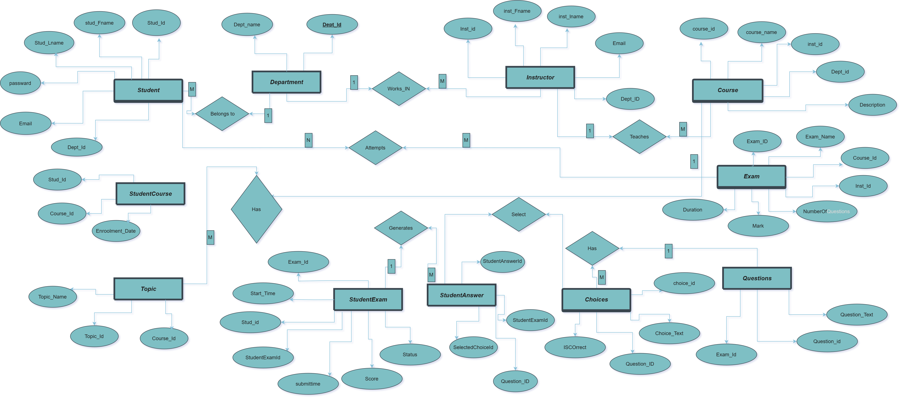
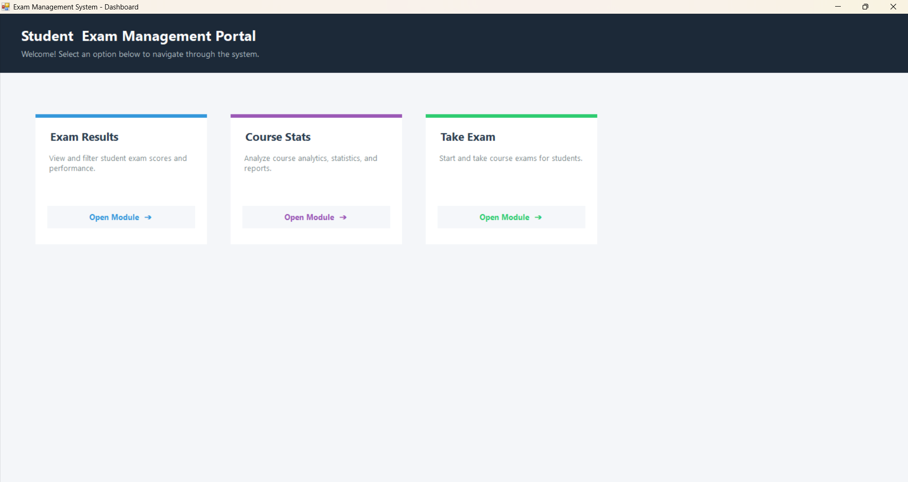
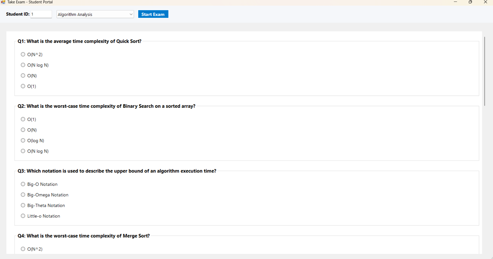
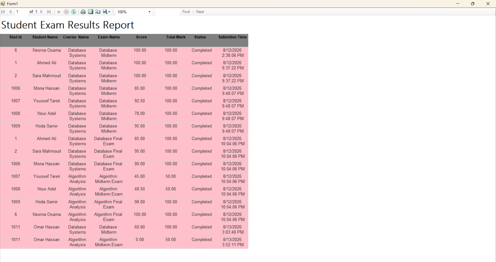
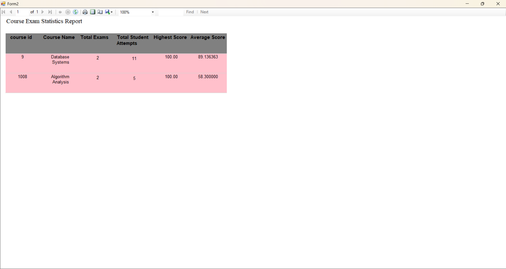

# Exam Management System Database (MS SQL Server)
An end-to-end relational database solution designed to manage academic institutions' exam lifecycles. Built with MS SQL Server and T-SQL, this project handles department structures, courses, students, instructors, exam generation, automated grading, audit security, and analytical performance reporting.

---

## Author
* **Developer:** Nesma Osama
* **Focus:** Database Architecture & T-SQL Development
* **Stack:** MS SQL Server | T-SQL | SSMS

---

## Key Features & Database Architecture

## Entity Relationship Diagram (ERD)

### 1. Relational Schema & Data Integrity
* **Core Entities:** `Department`, `Student`, `Instructor`, `Course`, `StudentCourse`, `Topic`, `Exam`, `Questions`, `Choices`, `StudentExam`, `StudentAnswer`.
* **Foreign Key Actions:** Enforces `ON DELETE CASCADE` and `ON DELETE SET NULL` constraints to ensure referential integrity across related records.

### 2. Business Logic (Stored Procedures)
* `sp_AddStudent`: Registers students with duplicate email validation.
* `sp_StartExam`: Creates an active exam session for a student.
* `sp_SaveStudentAnswer`: Handles real-time saving and updating of selected answers during an active session.
* `sp_SubmitExamSafe`: Evaluates student answers against correct choices, calculates scores dynamically, marks exams as `Completed`, and wraps updates inside an ACID Transaction with robust error handling (`TRY...CATCH`).

### 3. Data Protection (Audit Triggers)
* `trg_AuditScoreChange`: An `AFTER UPDATE` trigger enforcing security policies by preventing manual score modifications on completed exams.

### 4. Analytical Views & Reporting
* `v_StudentExamResults`: Consolidates student scores, course titles, exam names, and submission timestamps.
* `v_CourseExamStatistics`: Summarizes metrics per course, including total attempts, highest scores, and overall average scores.

### 5. Performance Optimization
* `IX_StudentAnswer_Exam`: Non-clustered index on `StudentAnswer` to accelerate grading joins and query execution time.

---

## How to Run

1. Open SQL Server Management Studio (SSMS).
2. Connect to your SQL Server instance.
3. Open `Master_Build_Script.sql`.
4. Run the script (`F5`).
5. The script automatically initializes `ExamManagementDB`, builds all constraints, compiles logic objects, inserts seed data, and executes an automated end-to-end test workflow.

---

## Built With
* **Database Engine:** Microsoft SQL Server
* **Language:** T-SQL (Transact-SQL)
* **IDE:** SQL Server Management Studio (SSMS)

* ---

## 🖥️ System Screenshots & UI Showcase

A visual walkthrough of the Exam Management System user interfaces and reporting modules:

### 1. Report Dashboard

### 2. Start Exam Portal

### 3. Live Exam Questions

### 4. Student Result Report

### 5. Course & Exam Statistics

